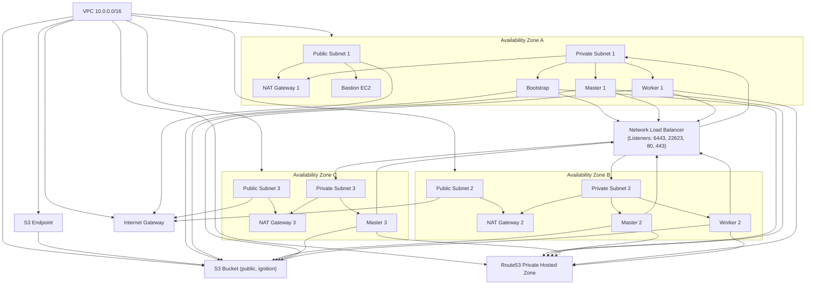

# OpenShift 4 BareMetal UPI on AWS (Terraform)

This project provides a complete, production-grade, two-stage Terraform automation for deploying an OpenShift 4 BareMetal UPI cluster on AWS, following best practices and the reference architecture described at [blackhatinside.com](https://blackhatinside.com/2024/08/10/how-to-create-openshift-4-baremetal-upi-cluster-on-aws/).

---

## Architecture Diagram

> **Figure: OpenShift 4 BareMetal UPI on AWS Architecture**  
> _Based on [blackhatinside.com: How to create an OpenShift 4 BareMetal UPI Cluster on AWS?](https://blackhatinside.com/2024/08/10/how-to-create-openshift-4-baremetal-upi-cluster-on-aws/)_

---

## Project Structure & Workflow

- **infra/**: Provisions all base AWS infrastructure (VPC, subnets, NAT, S3, NLB, Route53, bastion, etc.)
- **openshift_nodes/**: Provisions OpenShift bootstrap, master, and worker nodes, and manages NLB target group registration.

### **Deployment Steps**
1. Deploy `infra/` first. Use its outputs for the next stage.
2. SSH to the bastion host and follow the steps in `infra/BASTION_SETUP_STEPS.md` to prepare ignition configs and upload to S3.
3. Deploy `openshift_nodes/` to create the OpenShift nodes and register them with the NLB.

---

## Reference
- [How to create an OpenShift 4 BareMetal UPI Cluster on AWS? (blackhatinside.com)](https://blackhatinside.com/2024/08/10/how-to-create-openshift-4-baremetal-upi-cluster-on-aws/) 